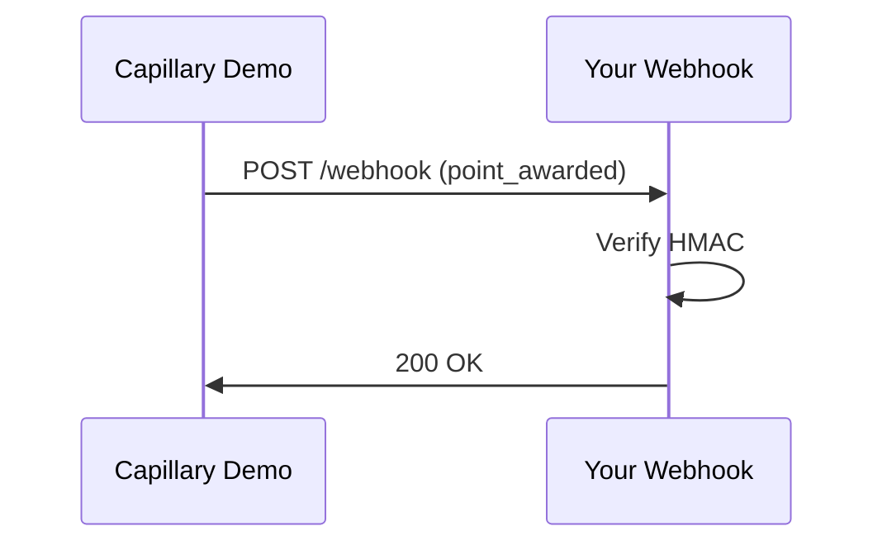

## Overview

Capillary Demo provides robust integrations to connect your loyalty program with e-commerce platforms, CRMs, marketing tools, and more. Use RESTful APIs, webhooks, and pre-built connectors to sync customer data, trigger rewards, and automate campaigns in real time.

<Callout kind="tip">
Review your third-party service's documentation for compatibility. Capillary Demo supports OAuth 2.0 and API key authentication for secure connections.
</Callout>

## Popular Integrations

Discover ready-to-use integrations that power your loyalty ecosystem.

<Columns cols={3}>
  <Card title="Shopify" icon="shopping-cart" href="https://shopify.com/integrations/capillary">
    Sync orders, customers, and inventory for personalized rewards.
  </Card>
  <Card title="Salesforce" icon="database" href="https://salesforce.com/integrations">
    Connect CRM data to enrich loyalty profiles and segment members.
  </Card>
  <Card title="Klaviyo" icon="mail" href="https://klaviyo.com/integrations">
    Trigger email/SMS campaigns based on loyalty events.
  </Card>
</Columns>

## Setting Up API Integrations

Follow these steps to integrate via API with e-commerce platforms.

<Steps>
  <Step title="Generate API Key" icon="key">
    Navigate to your Capillary Demo dashboard at `https://dashboard.example.com/settings/api`.
    
    Create a new key with scopes for `loyalty:read` and `loyalty:write`.
  </Step>
  <Step title="Authenticate Request" icon="shield">
    Use the API key in the `Authorization` header.
    
    <CodeGroup tabs="JavaScript,cURL">
    ````javascript
    const response = await fetch('https://api.example.com/v1/loyalty/points', {
      method: 'POST',
      headers: {
        'Authorization': `Bearer YOUR_API_KEY`,
        'Content-Type': 'application/json'
      },
      body: JSON.stringify({ customer_id: 'cust_123', points: 100 })
    });
    ````
    ````bash
    curl -X POST https://api.example.com/v1/loyalty/points \
      -H "Authorization: Bearer YOUR_API_KEY" \
      -H "Content-Type: application/json" \
      -d '{"customer_id": "cust_123", "points": 100}'
    ````
    </CodeGroup>
  </Step>
  <Step title="Test Integration" icon="check-circle">
    Verify the endpoint response and monitor logs in your dashboard.
  </Step>
</Steps>

<ParamField header="Authorization" param-type="string" required="true">
  Bearer token: `Bearer YOUR_API_KEY`.
</ParamField>

<ParamField body="customer_id" param-type="string" required="true">
  Unique customer identifier from your platform.
</ParamField>

## Configuring Webhooks

Set up webhooks for real-time events like point awards or redemptions.

<Tabs>
  <Tab title="Dashboard Setup" icon="settings">
    1. Go to `https://dashboard.example.com/webhooks`.
    2. Add your endpoint URL (e.g., `https://your-webhook-url.com/capillary`).
    3. Select events: `point_awarded`, `redemption_used`.
    
    <Callout kind="alert">
    Enable HMAC signature verification for security.
    </Callout>
  </Tab>
  <Tab title="Handle Payload" icon="code">
    ````javascript
    app.post('/capillary', (req, res) => {
      const signature = req.headers['x-capillary-signature'];
      const payload = req.body; // { event: 'point_awarded', customer_id: 'cust_123', points: 100 }
      
      if (verifySignature(signature, payload, YOUR_WEBHOOK_SECRET)) {
        // Process event
        console.log('Points awarded:', payload.points);
        res.status(200).send('OK');
      } else {
        res.status(401).send('Invalid signature');
      }
    });
    ````
  </Tab>
</Tabs>



## Connecting CRM and Marketing Tools

Use OAuth for seamless connections.

<Tabs>
  <Tab title="Salesforce" icon="database">
    Authorize via OAuth flow to sync loyalty tiers with CRM fields.
  </Tab>
  <Tab title="HubSpot" icon="users">
    Map loyalty events to contact properties for targeted nurturing.
  </Tab>
</Tabs>

<Response tabs="200">
```json
{
  "status": "success",
  "synced_customers": 1500,
  "next_sync": "2024-01-15T10:00:00Z"
}
```
</Response>

## Best Practices

<ExpandableGroup>
  <Expandable title="Secure Connections" default-open="true">
    - Rotate API keys every 90 days.
    - Use least-privilege scopes.
    - Validate all incoming webhooks with signatures.
  </Expandable>
  <Expandable title="Error Handling">
    Implement retries with exponential backoff for failed syncs.
    Log all integration events for auditing.
  </Expandable>
</ExpandableGroup>

<Callout kind="success">
Ready to integrate? Start with [Shopify](/integrations/shopify) or check the [API Reference](/api-reference).
</Callout>